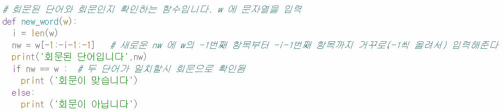

Peer Review Template
## PRT ##

**1. 주어진 문제를 해결하는 완성된 코드가 제출되었나요?**

- 테스트를 진행해본 결과, 주어진 문제를 정상적으로 해결하는 완성된 코드로 확인되었습니다.

**2. 전체 코드에서 가장 핵심적이거나 가장 복잡하고 이해하기 어려운 부분에 작성된 주석 또는 doc string 을 보고 해당 코드가 잘 이해되었나요?**

- 제일 중요한 기능인 회문 판별이 동작하는 과정이 담겨있는 코드이기에 핵심적인 부분으로 선택하였습니다.

- 회문 판별의 기능을 하고, 어떤 방식으로 회문을 판단하는지 기재되어 있어 이해가 되었습니다.

**3. 에러가 난 부분을 디버깅 문제를 해결한 기록을 남겼거나 새로운 시도 또는 추가 실험을 수행해봤나요?**

- 에러 없이 잘 수행하신 것 같습니다.

**4. 회고를 잘 작성하였나요? **

- 저도 그랬지만, 시간 관계 상 회고까지는 적어주시지 못했습니다. ㅜㅠ

## 회고 ## 

- coder: 김지영
- reviewer: 최성호

>> READM.md

